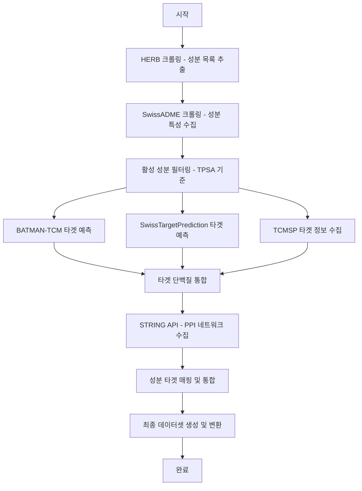

# 🌿 HERB Scraper 프로젝트

---

## 📌 **프로젝트 개요**  
HERB Scraper는 다양한 한약재 데이터를 자동으로 수집 및 처리하여 **SwissADME**, **BATMAN-TCM**, **TCMSP**, **STRING API** 등을 통해 활성 성분과 표적 단백질 정보를 종합하는 파이프라인 프로젝트입니다.  

✅ **주요 기능:**  
- 한약재 및 활성 성분 크롤링  
- 타겟 단백질 및 상호작용 정보 수집  
- 데이터 전처리 및 통합  
- 최종 데이터셋 생성 (CSV, XLSX, JSON)  

---

## 🗂️ **디렉토리 구조**
```bash
herb-scraper/
├── README.md                          # ✅ 프로젝트 설명 문서
├── requirements.txt                   # ✅ Python 패키지 목록
├── setup.py                           # ✅ 패키지 설정 파일
├── venv/                              # ✅ 가상환경 디렉토리
│
├── config/                            # ⚙️ 설정 관련
│   └── settings.py                    # 환경 설정 (경로, API URL, 타임아웃 등)
│
├── modules/                           # 🧩 코드 모듈 (핵심 기능)
│   ├── __init__.py
│   ├── constants/                     # 📄 상수 및 전역 변수 관리
│   │   ├── __init__.py
│   │   ├── herbs.py                   # 약재 URL 및 목록
│   │   └── apis.py                    # API URL 및 요청 설정
│   ├── crawlers/                      # 🕷️ 크롤러 모듈
│   │   ├── __init__.py
│   │   ├── herb_crawler.py            # HERB 크롤러
│   │   ├── swissadme_crawler.py       # SwissADME 크롤러
│   │   ├── batman_tcm_crawler.py      # BATMAN-TCM 크롤러
│   │   ├── swisstarget_crawler.py     # SwissTargetPrediction 크롤러
│   │   └── tcmsp_crawler.py           # TCMSP 크롤러
│   ├── converters/                    # 🔄 데이터 변환 모듈
│   │   ├── __init__.py
│   │   ├── to_csv.py                  # JSON → CSV 변환
│   │   ├── to_xlsx.py                 # JSON → XLSX 변환
│   │   └── to_json.py                 # CSV/XLSX → JSON 변환
│   ├── preprocessors/                 # 🧹 데이터 전처리 모듈
│   │   ├── __init__.py
│   │   ├── filter_compounds.py        # 활성 성분 필터링
│   │   ├── merge_herb_data.py         # 데이터 병합
│   │   └── target_mapping.py          # 타겟 단백질 매핑
│   ├── string_api/                    # 🧬 STRING API 모듈
│   │   ├── __init__.py
│   │   ├── string_id_fetcher.py       # STRING ID 매핑
│   │   ├── string_ppi_fetcher.py      # PPI 데이터 수집
│   │   └── compound_target_fetcher.py # 화합물 타겟 검색
│   └── utils/                         # 🛠️ 유틸리티 함수
│       ├── __init__.py
│       ├── data_utils.py              # 데이터 저장/불러오기 함수
│       ├── web_driver.py              # Selenium WebDriver 설정
│       ├── logger.py                  # 로깅 유틸리티
│       └── crawling_utils.py          # 크롤링 공통 함수
│
├── scripts/                           # 🚀 실행 스크립트
│   ├── __init__.py
│   ├── crawlers/                      # 🕷️ 크롤링 실행
│   │   ├── __init__.py
│   │   ├── run_herb_crawler.py        # HERB 크롤링 실행
│   │   ├── run_swissadme_crawler.py   # SwissADME 크롤링 실행
│   │   ├── run_batman_tcm_crawler.py  # BATMAN-TCM 크롤링 실행
│   │   ├── run_swisstarget_crawler.py # SwissTargetPrediction 크롤링 실행
│   │   └── run_tcmsp_crawler.py       # TCMSP 크롤링 실행
│   ├── converters/                    # 🔄 변환 실행
│   │   ├── __init__.py
│   │   ├── convert_to_csv.py
│   │   ├── convert_to_xlsx.py
│   │   └── convert_to_json.py
│   ├── preprocess/                    # 🧹 전처리 실행
│   │   ├── __init__.py
│   │   ├── filter_active_compounds.py # 성분 필터링 실행
│   │   └── merge_herb_data.py         # 데이터 병합 실행
│   ├── string_api/                    # 🧬 STRING API 실행
│   │   ├── __init__.py
│   │   ├── run_string_id_fetcher.py
│   │   ├── run_string_ppi_fetcher.py
│   │   └── run_compound_target_fetcher.py
│   └── main.py                        # 🌱 전체 파이프라인 실행
│
├── data/                              # 📂 데이터 저장
│   ├── raw/                           # 📥 원본 크롤링 및 API 데이터
│   │   ├── herb/                      # HERB 데이터
│   │   │   ├── ingredients/           # 성분 URL 및 상세 데이터
│   │   │   └── pages/                 # 크롤링한 HTML 페이지 (선택적 저장)
│   │   ├── swissadme/                 # SwissADME 원본 데이터
│   │   │   ├── raw_results/           # 크롤링 결과
│   │   │   └── logs/                  # 크롤링 로그
│   │   ├── batman_tcm/                # BATMAN-TCM 데이터
│   │   │   ├── raw_results/
│   │   │   └── logs/
│   │   ├── tcmsp/                     # TCMSP 데이터
│   │   │   ├── raw_results/
│   │   │   └── pages/
│   │   └── string/                    # STRING API 데이터
│   │       ├── id_map/
│   │       ├── ppi_results/
│   │       └── compound_targets/
│   └── processed/                     # 📝 전처리 및 가공 데이터
│       ├── filtered/                  # ✅ 필터링된 데이터
│       ├── merged/                    # 🔗 통합 데이터
│       └── final/                     # 📊 최종 결과
│           ├── csv/
│           ├── xlsx/
│           └── json/
│
├── logs/                              # 🗒️ 로그 파일 저장
└── tests/                             # 🧪 테스트 코드
    ├── __init__.py
    ├── test_crawlers.py
    ├── test_converters.py
    ├── test_preprocessors.py
    ├── test_string_api.py
    └── test_utils.py
```

---
## 🗺️ **📊 파이프라인 흐름도**



✅ 설명:
1. HERB 크롤링: 한약재별 활성 성분 URL 수집
2. SwissADME 크롤링: 성분의 약물유사성 및 물리화학적 특성 추출
3. BATMAN-TCM API 호출: 표적 단백질 정보 조회
4. SwissTargetPrediction 크롤링: 화합물 타겟 예측
5. TCMSP 크롤링: 활성 성분 및 타겟 단백질 정보 확보
6. 활성 성분 필터링: TPSA, GI 흡수율 등을 기준으로 필터링
7. 데이터 병합 및 통합: 각 단계 데이터를 통합하여 완성도 높은 데이터셋 생성
8. STRING ID 조회 및 PPI 데이터 수집: 단백질 상호작용 정보 추가
9. 화합물-타겟 단백질 매핑: 최종 매핑 및 데이터 정리
10. 데이터셋 변환: CSV, XLSX, JSON 포맷으로 최종 출력


## ⚙️ **실행 방법**
### 1️⃣ 가상환경 설정
```bash
python -m venv venv
source venv/bin/activate      # Mac/Linux
venv\Scripts\activate        # Windows
pip install -r requirements.txt
```

### 2️⃣ 전체 파이프라인 실행
```bash
python scripts/main.py --crawl --preprocess --convert
```

✅ **자동 실행 과정:**
1. HERB → 한약재별 활성 성분 크롤링  
2. SwissADME → 성분의 분자적 특성 크롤링  
3. BATMAN-TCM → 타겟 단백질 정보 수집
4. TCMSP → 활성 성분 및 타겟 단백질 정보 수집  
5. STRING API → 단백질 상호작용 정보 수집  
6. 데이터 통합 및 최종 데이터셋 생성

### 3️⃣ 개별 단계 실행 예시
#### 크롤링만 실행
```bash
python scripts/main.py --crawl
```
#### 전처리만 실행
```bash
python scripts/main.py --preprocess
```
#### 데이터 변환만 실행
```bash
python scripts/main.py --convert
```

---

## 🛠️ **주요 모듈 설명**
### 📄 `modules/constants/`
- **herbs.py**: 한약재 목록 및 URL 관리
- **apis.py**: API URL 및 요청 관련 상수 관리, 타임아웃 설정

### 🕷️ `modules/crawlers/`
- **herb_crawler.py**: HERB 성분 URL 및 데이터수집
- **swissadme_crawler.py**: SwissADME 분석 성분 데이터 수집
- **batman_tcm_crawler.py**: BATMAN-TCM 타겟 단백질 수집
- **tcmsp_crawler.py**: TCMSP 활성 성분 및 타겟 단백질 수집
- **swisstarget_crawler.py**: SwissTargetPrediction 타겟 단백질 수집

### 🔄 `modules/converters/`
- **to_csv.py**: JSON → CSV 변환
- **to_xlsx.py**: JSON → XLSX 변환
- **to_json.py**: CSV/XLSX → JSON 변환

### 🧹 `modules/preprocessors/`
- **filter_compounds.py**: 활성 성분 TPSA 필터링
- **merge_herb_data.py**: 다양한 데이터베이스의 데이터 병합
- **target_mapping.py**: 성분-타겟 단백질 매핑

### 🧬 `modules/string_api/`
- **string_id_fetcher.py**: 유전자 이름으로 STRING ID 조회
- **string_ppi_fetcher.py**: 단백질 상호작용 네트워크 조회
- **compound_target_fetcher.py**: 화합물-타겟 데이터 조회

### 🛠️ `modules/utils/`
- **data_utils.py**: 데이터 저장 및 로드
- **web_driver.py**: Selenium 설정
- **logger.py**: 로그 기록 설정
- **crawling_utils.py**: 크롤링 공통 함수

---

## 🧪 **테스트 실행 방법**
```bash
pytest tests/
```
✅ 테스트 범위:
- 크롤러 기능 검증
- 데이터 변환 검증 (JSON, CSV, XLSX)
- 전처리 기능 검증 (필터링, 병합)
- STRING API 통신 테스트
  
---
## 📦 **패키지 설치 및 CLI 사용**
### 1️⃣ 패키지 설치
```bash
pytest install .
```
### 2️⃣ CLI 실행
```bash
herb-scraper --crawl --preprocess --convert
```

---


## 📜 **라이선스**
MIT License  
© 2025 상지한의 학술제

---

## 👩‍💻 **개발자 정보**
프로젝트 담당:  
📧 이메일: neulbokim@sogang.ac.kr  
🌍 GitHub: github.com/neulbokim