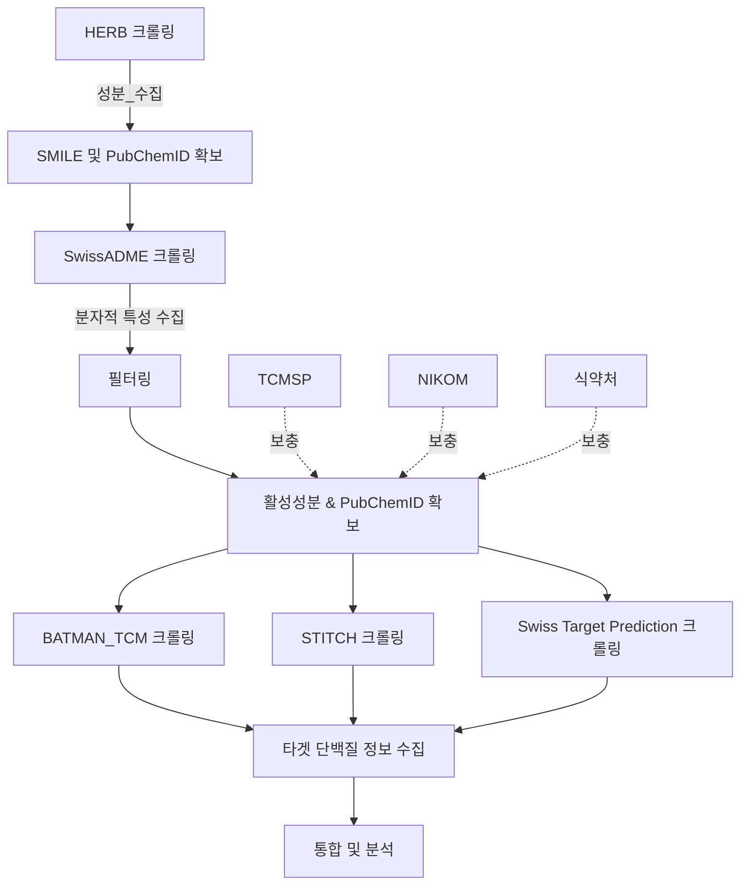

# 🌿 HERB Scraper 프로젝트

## **📌 프로젝트 개요**
HERB Scraper는 한약재 데이터를 자동으로 크롤링하여 **SwissADME** 및 **BATMAN-TCM API**에서 분자적 특성과 표적 단백질 정보를 수집하고,  
최종적으로 하나의 데이터셋(`final_dataset.csv`)을 생성하는 파이프라인 프로젝트입니다.

## 📂 디렉토리 구조
```
herb-scraper
├── README.md
├── __pycache__
├── backup
├── config
│   └── settings.py
├── data
│   ├── processed
│   └── raw
├── logs
├── modules
│   ├── __init__.py
│   ├── batman_tcm_utils.py
│   ├── data_utils.py
│   ├── herb_utils.py
│   ├── preprocessing.py
│   └── swissadme_utils.py
├── requirements.txt
├── scripts
│   ├── batman_tcm_query.py
│   ├── herb_scraper.py
│   ├── main.py
│   ├── preprocess_data.py
│   ├── swissadme_process.py
│   └── swissadme_query.py
├── setup.py
└── venv
```

---

## **⚙️ 실행 방법**
### **1️⃣ 가상환경 설정**
```bash
python -m venv venv
source venv/bin/activate  # Mac/Linux
venv\Scripts\activate     # Windows
pip install --upgrade pip
pip install -r requirements.txt
```

### **2️⃣ 전체 데이터 수집 실행**
```bash
cd scripts
python main.py
```
✅ 자동으로 실행되는 과정:

1. HERB 크롤링 → 한약재별 성분 데이터 수집 (SMILES, ID 확보)
2. SwissADME 크롤링 → 각 성분의 분자적 특성 정보 수집 및 필터링
3. BATMAN-TCM, STITCH, Swiss Target Prediction API 호출 → 활성 성분의 타겟 단백질(Target Name) 조회
4. 추가 데이터 수집 → TCMSP, NIKOM, 식약처 데이터 활용
5. 데이터 통합 및 정리 → 최종 데이터셋(final_dataset.csv) 생성

---

## **📊 데이터 흐름**
본 과정에서는 한약재 성분을 크롤링하고, SwissADME를 이용하여 필터링한 후, 다양한 API(BATMAN-TCM, STITCH, Swiss Target Prediction)를 통해 타겟 단백질 정보를 수집하여 **최종 데이터셋을 구축**합니다. 추가적으로 TCMSP, NIKOM, 식약처 데이터를 보완 자료로 활용하여 보다 신뢰성 높은 데이터를 확보합니다.



---

## **📂 데이터 저장 구조**
📌 각 단계에서 생성된 데이터를 `data/` 폴더에 저장합니다.

```
data/
├── raw/                  # 📁 원본 크롤링 및 API 데이터
│   ├── herb_ingredients.json      # HERB 크롤링 결과
│   ├── swissadme_results.json     # SwissADME 크롤링 원본 데이터
│   ├── batman_tcm_results.json    # BATMAN-TCM API 원본 데이터
├── processed/             # 📁 가공된 데이터 저장
│   ├── swissadme_filtered.json    # SwissADME 필터링된 데이터
│   ├── final_dataset.csv          # ✅ 최종 통합된 데이터셋
```

---

## **1️⃣ HERB 크롤링 (`herb_scraper.py`)**
✅ **수집 데이터 (`data/raw/herb_ingredients.json`)**  
| 한약재 | 성분 ID | Molecule SMILE |  
|------|------|----------------|  
| 황금  | HBIN000280 | CCCCC=CCCC=CCCCC |  

```json
{
  "황금": [
    {
      "ingredient_url": "http://herb.ac.cn/Detail/?v=HBIN000280&label=Ingredient",
      "molecule_smile": "CCCCC=CCCC=CCCCC",
      "related_targets": []
    }
  ]
}
```

---

## **2️⃣ SwissADME 크롤링 (`swissadme_query.py`)**
✅ **수집 데이터 (`data/raw/swissadme_results.json`)**  
| Molecule SMILE | TPSA | Lipinski | Bioavailability |  
|---------------|------|---------|----------------|  
| CCCCC=CCCC=CCCCC | 45.67 | 4 | 0.55 |  

```json
[
  {
    "molecule_smile": "CCCCC=CCCC=CCCCC",
    "TPSA": "45.67",
    "Lipinski's rule": "4",
    "Bioavailability Score": "0.55",
    "Water Solubility": "-5.2",
    "GI absorption": "High"
  }
]
```

---

## **3️⃣ SwissADME 데이터 필터링 (`swissadme_process.py`)**
✅ **필터링된 데이터 (`data/processed/swissadme_filtered.json`)**  
| Molecule SMILE | TPSA | Lipinski | Bioavailability |  
|---------------|------|---------|----------------|  
| CCCCC=CCCC=CCCCC | 45.67 | 4 | 0.55 |  

```json
[
  {
    "molecule_smile": "CCCCC=CCCC=CCCCC",
    "TPSA": 45.67,
    "Lipinski": 4,
    "Bioavailability": 0.55
  }
]
```

---

## **4️⃣ BATMAN-TCM API 호출 (`batman_tcm_query.py`)**
✅ **수집 데이터 (`data/raw/batman_tcm_results.json`)**  
| Molecule SMILE | 표적 단백질 리스트 |  
|---------------|----------------|  
| CCCCC=CCCC=CCCCC | ABC1, XYZ2, PQR3 |  

```json
{
  "CCCCC=CCCC=CCCCC": [
    "ABC1",
    "XYZ2",
    "PQR3"
  ]
}
```

---

## **5️⃣ 데이터 통합 (`preprocess_data.py`)**
✅ **최종 데이터셋 (`data/processed/final_dataset.csv`)**  
| 한약재 | 성분 ID | Molecule SMILE | TPSA | Lipinski | Bioavailability | 표적 단백질 리스트 |  
|------|------|----------------|------|---------|----------------|----------------|  
| 황금  | HBIN000280 | CCCCC=CCCC=CCCCC | 45.67 | 4 | 0.55 | ABC1, XYZ2, PQR3 |  

```csv
herb,ingredient_id,molecule_smile,TPSA,Lipinski,Bioavailability,target_proteins
황금,HBIN000280,CCCCC=CCCC=CCCCC,45.67,4,0.55,"ABC1, XYZ2, PQR3"
```

---

## **📌 실행 방법**
### **1️⃣ 가상환경 설정**
```bash
python -m venv venv
source venv/bin/activate  # Mac/Linux
venv\Scripts\activate      # Windows
pip install --upgrade pip
pip install -r requirements.txt
```

### **2️⃣ 전체 데이터 수집 실행**
```bash
cd scripts
python main.py
```
✅ **자동으로 실행되는 과정:**  
1. HERB 크롤링 → **한약재별 활성 성분 데이터 수집**  
2. SwissADME 크롤링 → **각 성분의 분자적 특성 정보 수집**  
3. BATMAN-TCM API 호출 → **각 성분의 표적 단백질(Target Name) 조회**  
4. 데이터 통합 → **최종 데이터셋(`final_dataset.csv`) 생성**  

---

## **📌 환경 설정 (`config/settings.py`)**
📌 **Selenium & API 환경 설정**
```python
BATMAN_TCM_API_URL = "http://batman2api.cloudna.cn/queryTarget"
CHROMEDRIVER_PATH = "../modules/chromedriver"
BATMAN_TCM_REQUEST_DELAY = 1  # API 요청 간 1초 대기
SWISSADME_WAIT_TIME = 5  # SwissADME 크롤링 시 로딩 대기 시간
```

---

## **🛠️ 오류 해결 (FAQ)**
### **❌ `pip install -r requirements.txt` 오류 발생 시**
```bash
rm requirements.txt
echo -e "requests\nbeautifulsoup4\nselenium\npandas\nnumpy" > requirements.txt
pip install -r requirements.txt
```

### **❌ ChromeDriver 관련 오류**
- **Mac**: `brew install chromedriver`
- **Windows**: [ChromeDriver 다운로드](https://sites.google.com/chromium.org/driver/) 후 `modules/chromedriver`에 저장

---

## **📌 추가 개발 예정**
✅ **SwissADME 데이터를 더 세분화하여 분석**  
✅ **데이터 시각화 추가 (표적 단백질 네트워크 분석)**  

---
## **📜 라이선스**
MIT License  
© 2025 상지한의 학술제 Project

---
## **👩‍💻 개발자 정보**
**프로젝트 담당:**  
📧 **이메일:** neulbokim@sogang.ac.kr  
🌍 **GitHub:** [github.com/neulbokim](https://github.com/neulbokim)  
